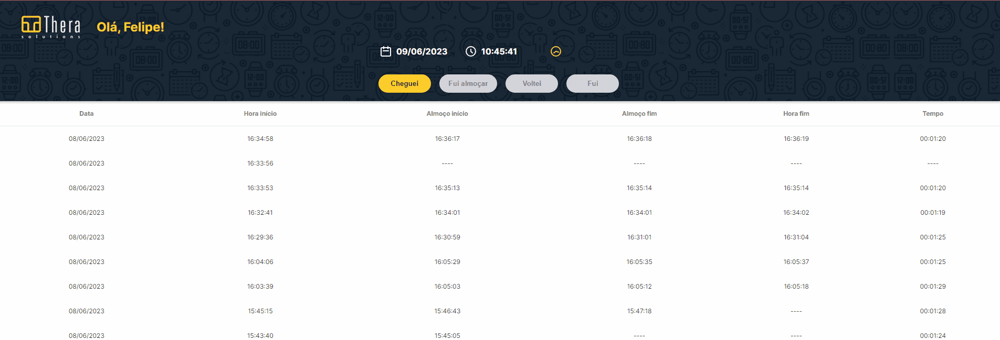

<h1> Ponto Eletrônico App </h1>

<strong>💻 Para visualizar o projeto clique aqui: <a href="https://ponto-eletronico-app.vercel.app/">Ponto Eletrônico App</a></strong>
<br><br>

<h2>📕 Descrição:</h2>

<p>
 As funcionalidades seriam:

<ul>- Usuário faz o login e entra na tela que tem:
<li>os botões de ponto</li>
<li>uma lista dos horários registrados de cada dia</li>
</ul>
<ul>- Ao começar ele clica em “cheguei”, quando for almoçar clica em “fui almoçar”, quando voltar do almoço clica em “voltei” e quando for terminar o dia clica em “fui”.</ul>
<strong>Obs</strong>.: vale lembrar que o usuário não pode ter mais de 1 registro dos seus horários por dia. Além disso, em um determinado dia, ele só pode clicar nos botões uma única vez.

<ul>Esses cliques são registrados na tabela em baixo dos botões e quando ele finalizar o dia, deve calcular o tempo total utilizado e preencher a coluna “tempo” da tabela.</ul>
<ul>Na interface há também um cronometro, que deve ser mostrado ao usuário e ir contando o tempo enquanto ele não estiver no período do almoço.</ul>

<h2> 🚶Passo a passo:</h2>

Execute o servidor de desenvolvimento:

```bash
npm run dev
```

Abra [http://localhost:3000](http://localhost:3000) com seu navegador para ver o resultado.
<br><br>

<strong>Obs.: Para mostrar o valor final registrado na tabela, deve-se atualizar a página no final do processo de registros</strong>

<h2> 💻Tecnologias usadas:</h4>
<ul>
    <li>Html5;</li>
    <li>CSS3/Sass;</li>
    <li>Javascript/TypeScript;</li>
    <li>ReactJS;</li>
    <li>Next.js.</li>
</ul>
<br><br>

Todas informações foram buscadas da API: <a href="https://theraponto.dev.thera.com.br:4433/swagger/index.html"> Thera Ponto</a>

<h2> 🎥Demonstração:</h2>

<br><br>

<h2>🎈To Do: </h2>
<li>Reorganizar states para que as ações dos botões atualizem o state da table; (Atualizar a tabela de acordo que o tempo for sendo registrado);</li>
<li>Verificar se o token está expriado e fazer a renovação dele.</li>
<br>

<br>
<h4>🖌️ Paleta de cores usada: </h4>
<ul>
    <li> ⚪ Branco:	hex-> #ffffff | hsl-> hsl(0, 0%, 100%)</li>
    <li> 🟡 Amarelo: hex-> #FCCD2A | hsl-> hsl(47, 97%, 58%)</li>
    <li> ⚫ Preto: hex-> #313030 | hsl-> hsl(0, 1%, 19%)</li>
</ul>